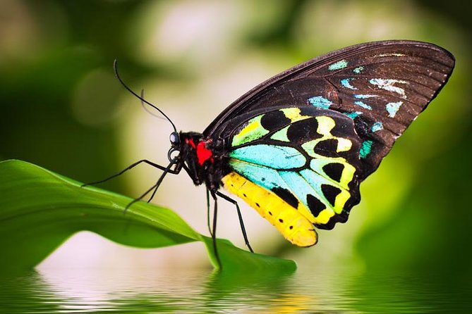

# LAB_ImageProcessing
## Getting started with Image Processing ,this are program as part of college Labwork 

1. Develop a program to display grayscale image using read and write operation.

    Objective is read and display gray image and lastly save the image  
    See the ImgP_1 for code and better understanding 
    Output  
    Orginal Image  
    

Gray Image
    

2. Develop a program to perform linear transformations on an image: Scaling and
Rotation
3. Create ‘n’ number of images and read them from the directory and
perform the operations.
4. Develop a program to convert the color image to gray scale and binary image.
5. Develop a program to convert the given color image to different color spaces.
6. Develop a program to create an image from 2D array (generate an array of
random size).
