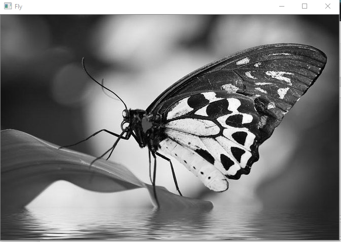
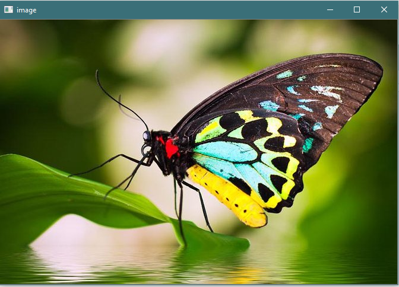
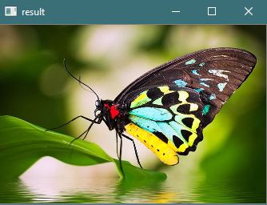
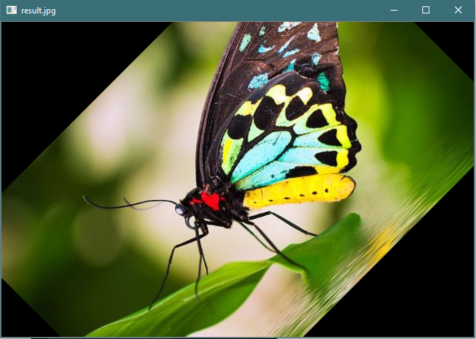

# LAB_ImageProcessing
## Getting started with Image Processing ,this are program as part of college Labwork 

Images Folder  --> its contains all images used in program ,you can use any image. 
ResultsImg ---> You can skip it. 
Doc Folder ---> contains all code with excepted output 
Libray used ---> Opencv2,Pillow,Numpy,Glob
### 1. Develop a program to display grayscale image using read and write operation.

     Objective is read and display gray image and lastly save the image 
     See the ImgP_1 for code and better understanding
   **Output**  
    Orginal Image  
     

Gray Image 
     

### 2. Develop a program to perform linear transformations on an image: Scaling and
     Rotation 
       For scaling i used resize() function 
       For Rotation  getRotationMatrix2D()  
**Output** 
Resize 
      
Rotation 
    
   
### 3. Create ‘n’ number of images and read them from the directory and
perform the operations.

I used Glob Libray for read the file from directory can use os libray also. 
#### This will all image in folder ,please see the Doc floder

### 4. Develop a program to convert the color image to gray scale and binary image.
      
      We have done converting to gray ,take the same image and apply the thershold function with parameter src,thershold max and min and cv2.THRESH_BINARY: If pixel intensity is greater than the set threshold, value set to 255, else set to 0 (black).
      
### 5. Develop a program to convert the given color image to different color spaces.
      Color spaces are different types of color modes, used in image processing and signals and system for various purposes. Some of the common color spaces are: RGB.
      we converting to GRAY,HSV,HLS,YUV.
      Using the cvtColor () function 
      gray=cv2.cvtColor(img,cv2.COLOR_BGR2GRAY)
     
### 6. Develop a program to create an image from 2D array (generate an array of random size).
     Using numpy to create the array of zeros , list operation to specific the region ,fromarray(array) #convert the image array to Image
     
     
#### Good if you are reading still ,i will be happy to see any improvement .
